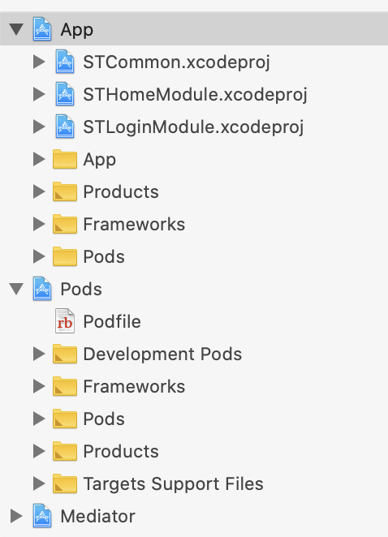
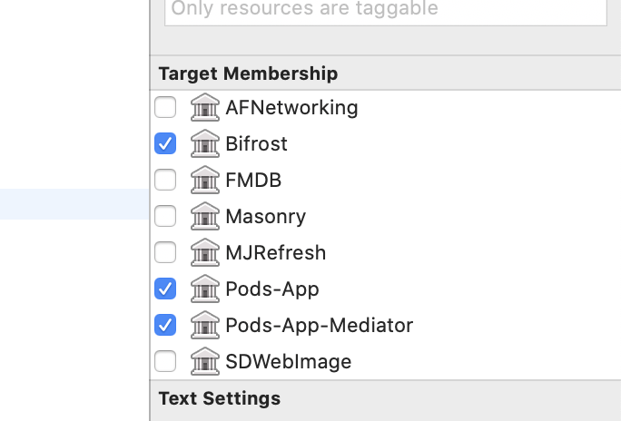

### xcode共享pods

#### 需求分析：

使用场景：
1、模块拆分。
2、不同App需要统一管理Pods。
3、正在开发中的framework/lib。
4、保证每个模块可以共享第三方库，降低库本身大小。

原理：
1、利用Xcode中的target，引用不同的.a文件
2、pods会生成一个workspace，并且可以针对不同的target引用不同的pod 库，以适配不同库的不同需要，为后期制作成pod库提供方便

#### 实际操作

##### 工程结构



##### Podfile 文件

```
# Uncomment this line to define a global platform for your project
platform :ios, '10.0'
# Uncomment this line if you're using Swift
#use_frameworks!

#disable some warnings
post_install do |installer|
    installer.pods_project.targets.each do |target|
        target.build_configurations.each do |config|
            #disable some warnings of Pods
            config.build_settings['CLANG_WARN_DOCUMENTATION_COMMENTS'] = 'NO'
            config.build_settings['IPHONEOS_DEPLOYMENT_TARGET'] = '10.0'
        end
    end
end

# 针对工程中需要的pod库，在这里可以引用module的私有库
def appPods()
    pod 'Masonry',                      '1.1.0'
    pod 'MJRefresh',                    '3.1.15.7'
    pod 'FMDB',                         '2.7.5'
    pod 'SDWebImage',                   '~> 4.0'
    pod 'AFNetworking',                 '~> 3.0'
end

# 针对Mediator target
def mediatorPods()
    pod 'Bifrost', :path => './'
end

workspace "AppModule"
target "App" do 
    project "App/App.xcodeproj"
    appPods()
  
  target "Mediator" do
      project 'Mediator/Mediator.xcodeproj'
      mediatorPods()
  end
end
```

在这里，需要为每个target配上正确的pod，否则容易报错，并且引入不必要的bug

demo中每个子模块都是以工程的方式存在，主要是为了方便开发及修改，后期如果做成component的话需要将其作为二进制文件被其他的工程使用，使用pod私有库的更加方便，并能提升效率。

如果有正在开发的pod库需要将其文件加入到pod编译中：


#### 参考

[有赞组件化](https://github.com/youzan/Bifrost)

[阿里组件化框架BeeHive](http://liumh.com/2018/10/11/beehive-analysis/)

[iOS使用Workspace来管理多项目](https://www.jianshu.com/p/b6c59d8ed2c9)

[iOS-cmake](https://github.com/leetal/ios-cmake)

[cmake入门](https://www.hahack.com/codes/cmake/)